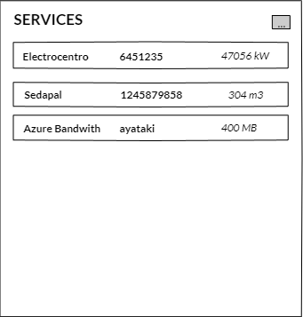
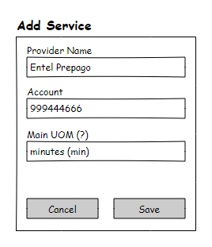
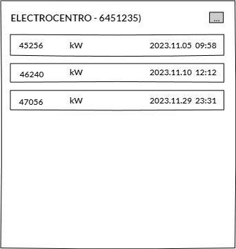
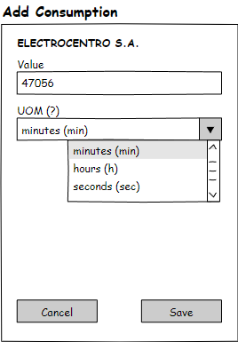
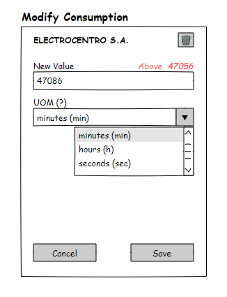
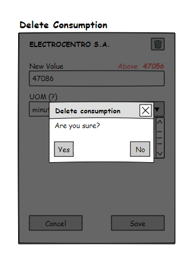

# 🚧 MUYUY `v1`

### 💠 Services

##### 🟢 GET / LIST SERVICES


```js
GET {{host}}/services
```

**Get Request**
```js
{ }
```

**Get Response**

```js
200 OK
```

```json
[
    {
        "providerId": "1",
        "providerName": "electrocentro s.a.",
        "account": "6541235",
        "accumulated": 47056,
        "uom": {
            "uomId": 1,
            "abbreviation": "kW",
            "description": "kilowatt"
        }
    },
    {
        "providerId": "2",
        "providerName": "SEDAM s.a.",
        "account": "1245879858",
        "accumulated": 304,
         "uom": {
            "uomId": 2,
            "abbreviation": "m3",
            "description": "cubic meters"
        }
    },
    {
        "providerId": "3",
        "providerName": "azure",
        "account": "ayataki",
        "accumulated": 400,
         "uom": {
            "uomId": 3,
            "abbreviation": "MB",
            "description": "megabytes"
        }
    }
]
```

##### 🔵 POST / REGISTER SERVICE



```js
POST {{host}}/services/register
```

**Register Request**

```json
{
    "providerName": "entel prepago",
    "account": "999444666",
    "accumulated": 0,
    "uomId": 5
}
```


**Register Response**
```js
200 OK
```

```json
{
    "providerId": 5,
    "providerName": "entel prepago",
    "account": "999444666",
    "accumulated": 0,
    "uom": {
        "uomId": 5,
        "abbreviation": "min",
        "description": "minutes"
    }
}
```

### 💠 Service Consumption

##### 🟢 GET / LIST SERVICE CONSUMPTION



```js
GET {{host}}/services/{{providerId}}
```

**Consumption Request**
```js
{ }
```

**Consumption Response**
```js
200 OK
```

```json
{
    "providerId": "1",
    "providerName": "electrocentro s.a.",
    "account": "6541235",
    "consumption": [
        {
            "consuptionId": "454c4e30-f165-4334-8736-f6c770a85328",
            "value": 45256.00,
            "unitOfMeasure": {
                "unitOfMeasureId": 1,
                "abbreviation": "kW",
                "name": "kilowatt"
            },
            "timestamp": "2023.11.05 09:58:03.000+00:00"
        },
        {
            "consuptionId": "7dfbc203-2b1b-4a59-a5a6-d70d020b70c6",
            "value": 46240.00,
            "uomId": "001",
            "timestamp": "2023.11.10 12:12:24.000+00:00"
        },
        {
            "consuptionId": "abf38604-1376-4c36-a7af-7dc2a16002da",
            "value": 47056.00,
            "uomId": "001",
            "timestamp": "2023.11.29 23:31:00.000+00:00"
        }
    ]
}
```

##### 🔵 POST / REGISTER SERVICE CONSUMPTION



```js
POST {{host}}/services/{{providerId}}/consumption
```


**Add Consumption Request**

```js
{
    "value": 45256.00,
    "uomId": 5
}
```

**Add Consumption Response**

```js
200 OK
```

```json
{
    "consuptionId": "454c4e30-f165-4334-8736-f6c770a85328",
    "value": 45256.00,
    "unitOfMeasure": {
        "unitOfMeasureId": 1,
        "abbreviation": "kW",
        "name": "kilowatt"
    },
    "timestamp": "2023.11.05 09:58:03.000+00:00"
}
```

##### 🟡 PUT/PATCH / MODIFY CONSUMPTION



```js
PUT {{host}}/services/{{providerId}}/consumption/{{consumptionId}}
```


**Add Consumption Request**

```js
{
    "value": 45256.00,
    "uomId": 5
}
```

**Add Consumption Response**

```js
200 OK
```

```json
{
    "consuptionId": "454c4e30-f165-4334-8736-f6c770a85328",
    "value": 45256.00,
    "unitOfMeasure": {
        "unitOfMeasureId": 1,
        "abbreviation": "kW",
        "name": "kilowatt"
    },
    "timestamp": "2023.11.05 09:58:03.000+00:00"
}
```

##### 🔴 DELETE / DELETE CONSUMPTION



```js
DELETE {{host}}/services/{{providerId}}/consumption/{{consumptionId}}
```


**Delete Consumption Request**

```json
{ }
```

**Add Consumption Response**

```js
204 NO CONTENT
```

```json
{ }
```


### 💠 General

#### Unit of Measurement
##### 🟢 GET
```js
GET {{host}}/general/{{uomId}}
```

```json
{
    "uomId": 1,
    "abbreviation": "kW",
    "name": "kilowatt"
}
```

##### 🔵 POST
```js
POST {{host}}/general/{{uomId}}
```

##### Response
```js
200 OK
```

```json
{
    "uomId": 1,
    "abbreviation": "kW",
    "name": "kilowatt"
}
```

##### 🟡 PUT/PATCH

##### 🔴 DELETE